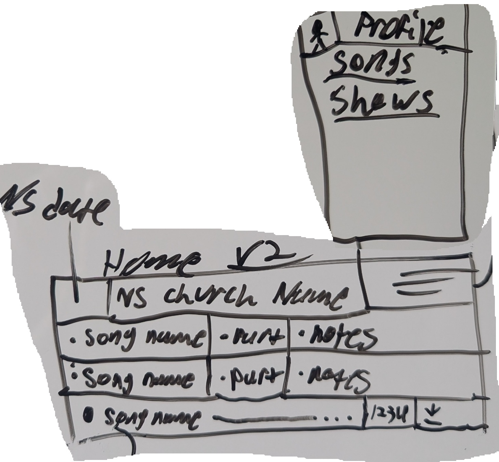
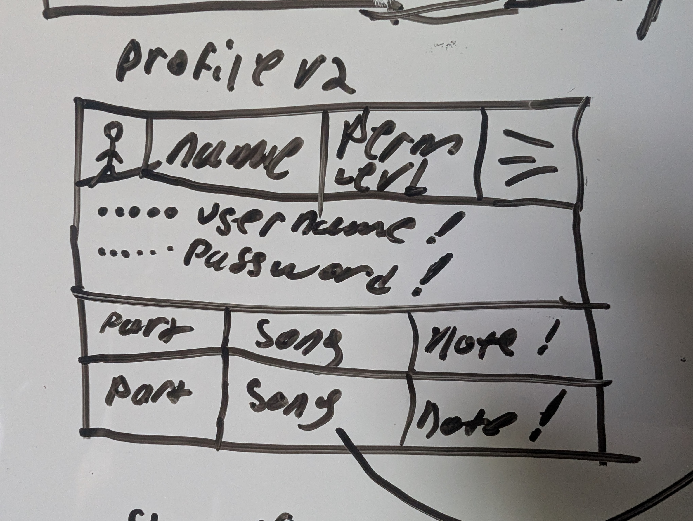
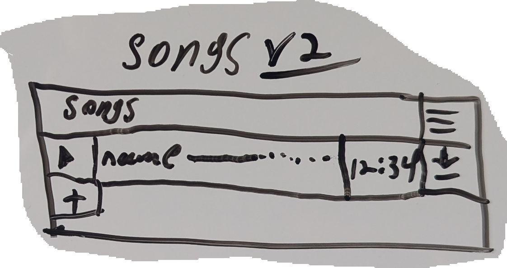
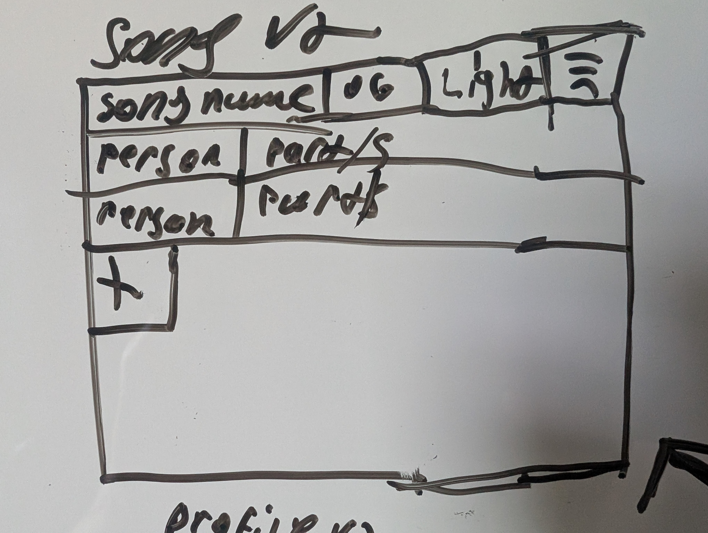
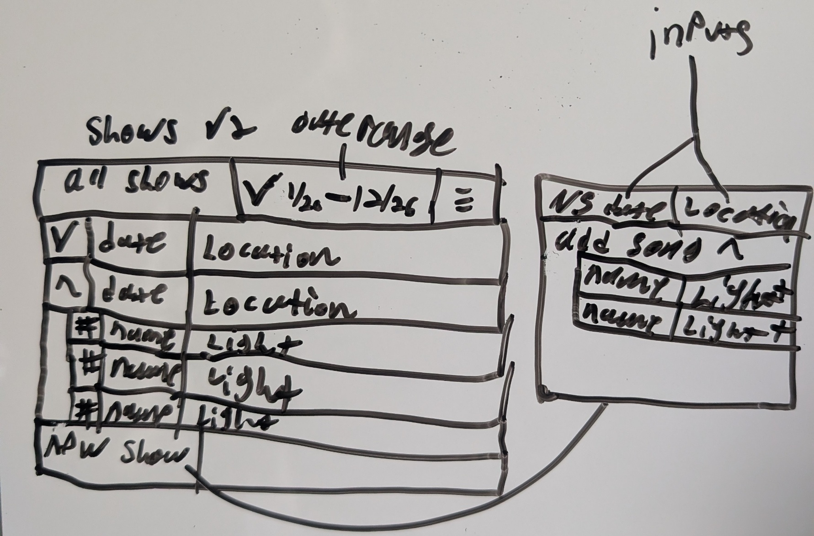
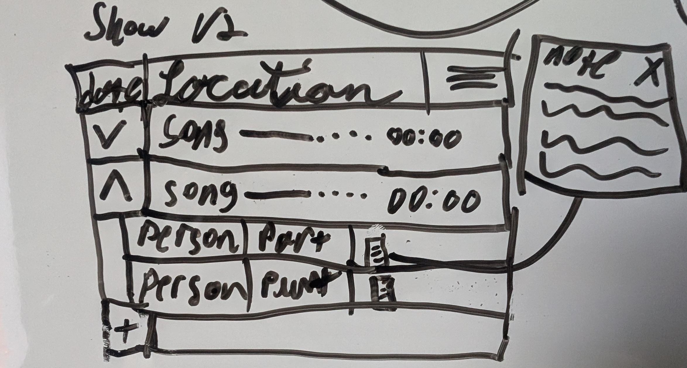

Puppet app for the Followers of God Puppet Team to help with coordinating positions and making every member
an expert of their position.

The Creation of this app stems from a problem discovered during my 10+ years of performing on the team. 
The puppeteers were unsure of their parts and CD's needed to be made for each show to distribute the music to all the puppeteers for them to listen to. 
This to me was inefficient and wasteful, So my idea was to initially use Google Drive to store music and give anyone with the link access to the folder. 
While Google Drive will work for a while it becomes monotonous to insert the songs and send out links after every change.

Now to my current idea and the purpose for the Repo, A Spring boot CRUD app to house puppeteer communication and information.
The vision for the app is to allow puppeteers to have accounts, download songs, Look at previous shows, see upcoming shows, and see any of their parts for those shows.

The Plan:
1. Create low fidelity Wireframes for the pages and refine them with experienced puppeteer feedback.
2. Create Mid-High fidelity wireframes and refine.
3. Using Spring boot, Amazon S3, and Thymeleaf, create an interactive web app.
4. Migrate through Thymeleaf into an angular based frontend.
5. Create a dedicated Andorid mobile application frontend.
6. Create an Apple application front end.

Step 1:

Low fidelity wireframes have been developed.

The Home page above Shows "NS date" which is the date for the next show, Next show church name, and hamburger buttons on the top bar.
The Hamburger button leads to a menu which will lead to profile, songs, or shows, **In the future there is planned to be pages for puppets and props.
Below the top bar is a list of each song (in the current/next show) that the current user is a part of, along with that user's parts are the notes inputted for those songs.
Below the list of parts will be another list of all the songs with the ability to play the song from the app, or download the song to their device.

The image shows a low fidelity profile page with an optional picture in the top left the name of the person and their permission level on the app.
Next, is the username and password obfuscated from sight unless the current password is given. Once the current password is given the user can edit both username or password.
Finally, the page lists all parts that the user is in regardless of whether the song is in the next show or not in alphabetical order.

Songs is the next button from the hamburger menu, it features the name of the page (Songs) and below that every song in record.
That includes a play button, name, play bar, song length, and download link.
Clicking on the song name takes the user to the "Song" page.
**Editors have the ability to add new songs to this database.

The Song page is a description of the song in question, having the dubbed song name, then an original song name then the light type used in performance.
Next is a list of all parts in that song and the people associated with those parts.
**Editors have the ability to add people/parts to the song page.

The Shows page gives a list of all previous shows, These shows will be from a date range selected by the user by year.
Below the top bar will be a list of the shows from the range selected and will be dropdown menus showing all songs from that show and the light type of the songs
**This is where editors will create new shows using the input panel that shows up after hitting new show.

The Show page will give information about the show chosen including the date, location, songs, and people in those songs.
**This page is where Editors will modify shows, add/remove people from shows and where people(puppeteer permission level(PPL)) will add notes about their parts.

